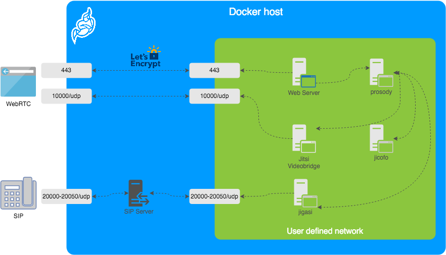

# Jitsi Meet on Docker


[Jitsi] is a set of Open Source projects that allows you to easily build and deploy secure
videoconferencing solutions.

[Jitsi Meet] is a fully encrypted, 100% Open Source video conferencing solution that you can use
all day, every day, for free — with no account needed.

This repository contains the necessary tools to run a Jitsi Meet stack on [Docker] using
[Docker Compose].

## Table of contents

* [Quick start](#quick-start)
* [Architecture](#architecture)
  - [Images](#images)
  - [Design considerations](#design-considerations)
* [Configurations](#configuration)
  - [Advanced configuration](#advanced-configuration)
  - [Running behind NAT or on a LAN environment](#running-behind-nat-or-on-a-lan-environment)
* [Build Instructions](#build-instructions)
* [ToDo](#todo)

<hr />

## Quick start

In order to quickly run Jitsi Meet on a machine running Docker and Docker Compose,
follow these steps:

* Clone this repository to your computer.
  * `git clone https://github.com/jitsi/docker-jitsi-meet && cd docker-jitsi-meet`
* Create a ``.env`` file by copying and adjusting ``env.example``
  * `cp env.example .env`
  * Set strong passwords in the security section options: `./gen-passwords.sh`
* Create required `CONFIG` directories
  * `mkdir -p ~/.jitsi-meet-cfg/{web/letsencrypt,transcripts,prosody,jicofo,jvb,jigasi,jibri}`
* Run ``docker-compose up -d``.
* Access the web UI at [``https://localhost:8443``](https://localhost:8443) (or a different port, in case you edited the compose file).

Note that HTTP (not HTTPS) is also available (on port 8000, by default), but that's e.g. for a reverse proxy setup;
direct access via HTTP instead HTTPS leads to WebRTC errors such as _Failed to access your microphone/camera: Cannot use microphone/camera for an unknown reason. Cannot read property 'getUserMedia' of undefined_ or _navigator.mediaDevices is undefined_.

If you want to use jigasi too, first configure your env file with SIP credentials
and then run Docker Compose as follows: ``docker-compose -f docker-compose.yml -f jigasi.yml up``

If you want to enable document sharing via [Etherpad], configure it and run Docker Compose as
follows: ``docker-compose -f docker-compose.yml -f etherpad.yml up``

If you want to use jibri too, first configure a host as described in JItsi BRoadcasting Infrastructure configuration section
and then run Docker Compose as follows: ``docker-compose -f docker-compose.yml -f jibri.yml up -d``
or to use jigasi too: ``docker-compose -f docker-compose.yml -f jigasi.yml -f jibri.yml up -d``

### Security note

This setup used to have default passwords for intetrnal accounts used across components. In order to make the default setup
secure by default these have been removed and the respective containers won't start without having a password set.

Strong passwordds may be generated as follows: `./gen-passwords.sh`
This will modify your `.env` file (a backup is saved in `.env.backup`) and set strong passwords for each of the
require options. Passwords are  generated using `openssl rand -hex 16` .

DO NOT reuse any of the passwords.

## Architecture

A Jitsi Meet installation can be broken down into the following components:

* A web interface
* An XMPP server
* A conference focus component
* A video router (could be more than one)
* A SIP gateway for audio calls
* A Broadcasting Infrastructure for recording or streaming a conference.



The diagram shows a typical deployment in a host running Docker. This project
separates each of the components above into interlinked containers. To this end,
several container images are provided.

### External Ports

The following external ports must be opened on a firewall:

* 80/tcp for Web UI HTTP (really just to redirect, after uncommenting ENABLE_HTTP_REDIRECT=1 in .env)
* 443/tcp for Web UI HTTPS
* 4443/tcp for RTP media over TCP
* 10000/udp for RTP media over UDP

Also 20000-20050/udp for jigasi, in case you choose to deploy that to facilitate SIP access.

E.g. on a CentOS/Fedora server this would be done like this (without SIP access):

```shell
    $ sudo firewall-cmd --permanent --add-port=80/tcp
    $ sudo firewall-cmd --permanent --add-port=443/tcp
    $ sudo firewall-cmd --permanent --add-port=4443/tcp
    $ sudo firewall-cmd --permanent --add-port=10000/udp
    $ sudo firewall-cmd --reload
```

### Images

* **base**: Debian stable base image with the [S6 Overlay] for process control and the
  [Jitsi repositories] enabled. All other images are based on this one.
* **base-java**: Same as the above, plus Java (OpenJDK).
* **web**: Jitsi Meet web UI, served with nginx.
* **prosody**: [Prosody], the XMPP server.
* **jicofo**: [Jicofo], the XMPP focus component.
* **jvb**: [Jitsi Videobridge], the video router.
* **jigasi**: [Jigasi], the SIP (audio only) gateway.
* **etherpad**: [Etherpad], shared document editing addon.
* **jibri**: [Jibri], the broadcasting infrastructure.

### Design considerations

Jitsi Meet uses XMPP for signaling, thus the need for the XMPP server. The setup provided
by these containers does not expose the XMPP server to the outside world. Instead, it's kept
completely sealed, and routing of XMPP traffic only happens on a user-defined network.

The XMPP server can be exposed to the outside world, but that's out of the scope of this
project.

## Configuration

The configuration is performed via environment variables contained in a ``.env`` file. You
can copy the provided ``env.example`` file as a reference.

**IMPORTANT**: At the moment, the configuration is not regenerated on every container boot, so
if you make any changes to your ``.env`` file, make sure you remove the configuration directory
before starting your containers again.

Variable | Description | Example
--- | --- | ---
`CONFIG` | Directory where all configuration will be stored | /opt/jitsi-meet-cfg
`TZ` | System Time Zone | Europe/Amsterdam
`HTTP_PORT` | Exposed port for HTTP traffic | 8000
`HTTPS_PORT` | Exposed port for HTTPS traffic | 8443
`DOCKER_HOST_ADDRESS` | IP address of the Docker host, needed for LAN environments | 192.168.1.1
`PUBLIC_URL` | Public URL for the web service | https://meet.example.com

**NOTE**: The mobile apps won't work with self-signed certificates (the default)
see below for instructions on how to obtain a proper certificate with Let's Encrypt.

### Let's Encrypt configuration

If you plan on exposing this container setup to the outside traffic directly and
want a proper TLS certificate, you are in luck because Let's Encrypt support is
built right in. Here are the required options:

Variable | Description | Example
--- | --- | ---
`ENABLE_LETSENCRYPT` | Enable Let's Encrypt certificate generation | 1
`LETSENCRYPT_DOMAIN` | Domain for which to generate the certificate | meet.example.com
`LETSENCRYPT_EMAIL` | E-Mail for receiving important account notifications (mandatory) | alice@atlanta.net

In addition, you will need to set `HTTP_PORT` to 80 and `HTTPS_PORT` to 443.

### SIP gateway configuration

If you want to enable the SIP gateway, these options are required:

Variable | Description | Example
--- | --- | ---
`JIGASI_SIP_URI` | SIP URI for incoming / outgoing calls | test@sip2sip.info
`JIGASI_SIP_PASSWORD` | Password for the specified SIP account | passw0rd
`JIGASI_SIP_SERVER` | SIP server (use the SIP account domain if in doubt) | sip2sip.info
`JIGASI_SIP_PORT` | SIP server port | 5060
`JIGASI_SIP_TRANSPORT` | SIP transport | UDP

### JItsi BRoadcasting Infrastructure configuration

Before running Jibri, you need to set up an ALSA loopback device on the host. This **will not**
work on a non-Linux host.

For CentOS 7, the module is already compiled with the kernel, so just run:

```
# configure 5 capture/playback interfaces
echo "options snd-aloop enable=1,1,1,1,1 index=0,1,2,3,4" > /etc/modprobe.d/alsa-loopback.conf
# setup autoload the module
echo "snd_aloop" > /etc/modules-load.d/snd_aloop.conf
# load the module
modprobe snd-aloop
# check that the module is loaded
lsmod | grep snd_aloop
```

For Ubuntu:

```
# install the module
apt update && apt install linux-image-extra-virtual
# configure 5 capture/playback interfaces
echo "options snd-aloop enable=1,1,1,1,1 index=0,1,2,3,4" > /etc/modprobe.d/alsa-loopback.conf
# setup autoload the module
echo "snd-aloop" >> /etc/modules
# check that the module is loaded
lsmod | grep snd_aloop
```

NOTE: if you are running on AWS you may need to reboot your machine to use the generic kernel instead
of the "aws" kernel.

If you want to enable Jibri these options are required:

Variable | Description | Example
--- | --- | ---
`ENABLE_RECORDING` | Enable recording conference to local disk | 1

Extended Jibri configuration:

Variable | Description | Example
--- | --- | ---
`JIBRI_RECORDER_USER` | Internal recorder user for Jibri client connections | recorder
`JIBRI_RECORDER_PASSWORD` | Internal recorder password for Jibri client connections | passw0rd
`JIBRI_RECORDING_DIR` | Directory for recordings inside Jibri container | /config/recordings
`JIBRI_FINALIZE_RECORDING_SCRIPT_PATH` | The finalizing script. Will run after recording is complete | /config/finalize.sh
`JIBRI_XMPP_USER` | Internal user for Jibri client connections. | jibri
`JIBRI_RECORDER_PASSWORD` | Internal user for Jibri client connections | passw0rd
`JIBRI_STRIP_DOMAIN_JID` | Prefix domain for strip inside Jibri (please see env.example for details) | muc
`JIBRI_BREWERY_MUC` | MUC name for the Jibri pool | jibribrewery
`JIBRI_PENDING_TIMEOUT` | MUC connection timeout | 90
`JIBRI_LOGS_DIR` | Directory for logs inside Jibri container | /config/logs

For using multiple Jibri instances, you have to select different loopback interfaces for each instance manually.

<details>
  <summary>Set interface in file `/home/jibri/.asoundrc` inside a docker container.</summary>

  Default the first instance has:

  ```
  ...
  slave.pcm "hw:Loopback,0,0"
  ...
  slave.pcm "hw:Loopback,0,1"
  ...
  slave.pcm "hw:Loopback,1,1"
  ...
  slave.pcm "hw:Loopback,1,0"
  ...
  ```

  For setup the second instance, run container with changed `/home/jibri/.asoundrc`:

  ```
  ...
  slave.pcm "hw:Loopback_1,0,0"
  ...
  slave.pcm "hw:Loopback_1,0,1"
  ...
  slave.pcm "hw:Loopback_1,1,1"
  ...
  slave.pcm "hw:Loopback_1,1,0"
  ...
  ```

  Also you can use numbering id for set loopback interface. The third instance will have `.asoundrc` that looks like:

  ```
  ...
  slave.pcm "hw:2,0,0"
  ...
  slave.pcm "hw:2,0,1"
  ...
  slave.pcm "hw:2,1,1"
  ...
  slave.pcm "hw:2,1,0"
  ...

  ```

</details>

### Authentication

Authentication can be controlled with the environment variables below. If guest
access is enabled, unauthenticated users will need to wait until a user authenticates
before they can join a room. If guest access is not enabled, every user will need
to authenticate before they can join.

Variable | Description | Example
--- | --- | ---
`ENABLE_AUTH` | Enable authentication | 1
`ENABLE_GUESTS` | Enable guest access | 1
`AUTH_TYPE` | Select authentication type (internal, jwt or ldap) | internal

#### Internal authentication

The default authentication mode (`internal`) uses XMPP credentials to authenticate users.
To enable it you have to enable authentication with `ENABLE_AUTH` and set `AUTH_TYPE` to `internal`,
then configure the settings you can see below.

Internal users must be created with the ``prosodyctl`` utility in the ``prosody`` container.
In order to do that, first, execute a shell in the corresponding container:

``docker-compose exec prosody /bin/bash``

Once in the container, run the following command to create a user:

``prosodyctl --config /config/prosody.cfg.lua register TheDesiredUsername meet.jitsi TheDesiredPassword``

Note that the command produces no output.

#### Authentication using LDAP

You can use LDAP to authenticate users. To enable it you have to enable authentication with `ENABLE_AUTH` and
set `AUTH_TYPE` to `ldap`, then configure the settings you can see below.

Variable | Description | Example
--- | --- | ---
`LDAP_URL` | URL for ldap connection | ldaps://ldap.domain.com/
`LDAP_BASE` | LDAP base DN. Can be empty. | DC=example,DC=domain,DC=com
`LDAP_BINDDN` | LDAP user DN. Do not specify this parameter for the anonymous bind. | CN=binduser,OU=users,DC=example,DC=domain,DC=com
`LDAP_BINDPW` | LDAP user password. Do not specify this parameter for the anonymous bind. | LdapUserPassw0rd
`LDAP_FILTER` | LDAP filter. | (sAMAccountName=%u)
`LDAP_AUTH_METHOD` | LDAP authentication method. | bind
`LDAP_VERSION` | LDAP protocol version | 3
`LDAP_USE_TLS` | Enable LDAP TLS | 1
`LDAP_TLS_CIPHERS` | Set TLS ciphers list to allow | SECURE256:SECURE128
`LDAP_TLS_CHECK_PEER` | Require and verify LDAP server certificate | 1
`LDAP_TLS_CACERT_FILE` | Path to CA cert file. Used when server certificate verification is enabled | /etc/ssl/certs/ca-certificates.crt
`LDAP_TLS_CACERT_DIR` | Path to CA certs directory. Used when server certificate verification is enabled. | /etc/ssl/certs
`LDAP_START_TLS` | Enable START_TLS, requires LDAPv3, URL must be ldap:// not ldaps:// | 0

#### Authentication using JWT tokens

You can use JWT tokens to authenticate users. To enable it you have to enable authentication with `ENABLE_AUTH` and
set `AUTH_TYPE` to `jwt`, then configure the settings you can see below.

Variable | Description | Example
--- | --- | ---
`JWT_APP_ID` | Application identifier | my_jitsi_app_id
`JWT_APP_SECRET` | Application secret known only to your token | my_jitsi_app_secret
`JWT_ACCEPTED_ISSUERS` | (Optional) Set asap_accepted_issuers as a comma separated list | my_web_client,my_app_client
`JWT_ACCEPTED_AUDIENCES` | (Optional) Set asap_accepted_audiences as a comma separated list | my_server1,my_server2
`JWT_ASAP_KEYSERVER` | (Optional) Set asap_keyserver to a url where public keys can be found | https://example.com/asap
`JWT_ALLOW_EMPTY` | (Optional) Allow anonymous users with no JWT while validating JWTs when provided | 0
`JWT_AUTH_TYPE` | (Optional) Controls which module is used for processing incoming JWTs | token
`JWT_TOKEN_AUTH_MODULE` | (Optional) Controls which module is used for validating JWTs | token_verification

This can be tested using the [jwt.io] debugger. Use the following sample payload:

```
{
  "context": {
    "user": {
      "avatar": "https://robohash.org/john-doe",
      "name": "John Doe",
      "email": "jdoe@example.com"
    }
  },
  "aud": "my_jitsi_app_id",
  "iss": "my_jitsi_app_id",
  "sub": "meet.jitsi",
  "room": "*"
}
```

### Shared document editing using Etherpad

You can collaboratively edit a document via [Etherpad]. In order to enable it, set the config options below and run
Docker Compose with the additional config file `etherpad.yml`.

Here are the required options:

Variable | Description | Example
--- | --- | ---
`ETHERPAD_URL_BASE` | Set etherpad-lite URL | http://etherpad.meet.jitsi:9001

### Transcription configuration

If you want to enable the Transcribing function, these options are required:

Variable | Description | Example
--- | --- | ---
`ENABLE_TRANSCRIPTIONS` | Enable Jigasi transcription in a conference | 1
`GC_PROJECT_ID` | `project_id` from Google Cloud Credentials
`GC_PRIVATE_KEY_ID` | `private_key_id` from Google Cloud Credentials
`GC_PRIVATE_KEY` | `private_key` from Google Cloud Credentials
`GC_CLIENT_EMAIL` | `client_email` from Google Cloud Credentials
`GC_CLIENT_ID` | `client_id` from Google Cloud Credentials
`GC_CLIENT_CERT_URL` | `client_x509_cert_url` from Google Cloud Credentials

For setting the Google Cloud Credentials please read https://cloud.google.com/text-to-speech/docs/quickstart-protocol section "Before you begin" paragraph 1 to 5.

### Advanced configuration

These configuration options are already set and generally don't need to be changed.

Variable | Description | Default value
--- | --- | ---
`XMPP_DOMAIN` | Internal XMPP domain | meet.jitsi
`XMPP_AUTH_DOMAIN` | Internal XMPP domain for authenticated services | auth.meet.jitsi
`XMPP_SERVER` | Internal XMPP server name xmpp.meet.jitsi | xmpp.meet.jitsi
`XMPP_BOSH_URL_BASE` | Internal XMPP server URL for BOSH module | http://xmpp.meet.jitsi:5280
`XMPP_MUC_DOMAIN` | XMPP domain for the MUC | muc.meet.jitsi
`XMPP_INTERNAL_MUC_DOMAIN` | XMPP domain for the internal MUC | internal-muc.meet.jitsi
`XMPP_GUEST_DOMAIN` | XMPP domain for unauthenticated users | guest.meet.jitsi
`XMPP_RECORDER_DOMAIN` | Domain for the jibri recorder | recorder.meet.jitsi
`XMPP_MODULES` | Custom Prosody modules for XMPP_DOMAIN (comma separated) | info,alert
`XMPP_MUC_MODULES` | Custom Prosody modules for MUC component (comma separated) | info,alert
`XMPP_INTERNAL_MUC_MODULES` | Custom Prosody modules for internal MUC component (comma separated) | info,alert
`GLOBAL_MODULES` | Custom prosody modules to load in global configuration (comma separated) | statistics,alert
`GLOBAL_CONFIG` | Custom configuration string with escaped newlines | foo = bar;\nkey = val;
`JICOFO_COMPONENT_SECRET` | XMPP component password for Jicofo | s3cr37
`JICOFO_AUTH_USER` | XMPP user for Jicofo client connections | focus
`JICOFO_AUTH_PASSWORD` | XMPP password for Jicofo client connections | passw0rd
`JVB_AUTH_USER` | XMPP user for JVB MUC client connections | jvb
`JVB_AUTH_PASSWORD` | XMPP password for JVB MUC client connections | passw0rd
`JVB_STUN_SERVERS` | STUN servers used to discover the server's public IP | stun.l.google.com:19302, stun1.l.google.com:19302, stun2.l.google.com:19302
`JVB_PORT` | UDP port for media used by Jitsi Videobridge | 10000
`JVB_TCP_HARVESTER_DISABLED` | Disable the additional harvester which allows video over TCP (rather than just UDP) | true
`JVB_TCP_PORT` | TCP port for media used by Jitsi Videobridge when the TCP Harvester is enabled | 4443
`JVB_BREWERY_MUC` | MUC name for the JVB pool | jvbbrewery
`JVB_ENABLE_APIS` | Comma separated list of JVB APIs to enable | none
`JIGASI_XMPP_USER` | XMPP user for Jigasi MUC client connections | jigasi
`JIGASI_XMPP_PASSWORD` | XMPP password for Jigasi MUC client connections | passw0rd
`JIGASI_BREWERY_MUC` | MUC name for the Jigasi pool | jigasibrewery
`JIGASI_PORT_MIN` | Minimum port for media used by Jigasi | 20000
`JIGASI_PORT_MAX` | Maximum port for media used by Jigasi | 20050
`JIGASI_ENABLE_SDES_SRTP` | Enable SDES srtp | 1
`JIGASI_SIP_KEEP_ALIVE_METHOD` | Keepalive method | OPTIONS
`JIGASI_HEALTH_CHECK_SIP_URI` | Health-check extension. Jigasi will call it for health check | keepalive
`JIGASI_HEALTH_CHECK_INTERVAL` | Interval of health check in milliseconds | 300000
`JIGASI_TRANSCRIBER_RECORD_AUDIO` | Jigasi will record audio when transcriber is on | true
`JIGASI_TRANSCRIBER_SEND_TXT` | Jigasi will send a transcribed text to the chat when transcriber is on | true
`JIGASI_TRANSCRIBER_ADVERTISE_URL` | Jigasi will post an URL to the chat with transcription file | true
`DISABLE_HTTPS` | Handle TLS connections outside of this setup | 1
`ENABLE_HTTP_REDIRECT` | Redirect HTTP traffic to HTTPS (necessary for Let's Encrypt) | 1
`LOG_LEVEL` | Controls which logs are output from prosody and associated modules | info

### Running behind NAT or on a LAN environment

If running in a LAN environment (as well as on the public Internet, via NAT) is a requirement,
the ``DOCKER_HOST_ADDRESS`` should be set. This way, the Videobridge will advertise the IP address
of the host running Docker instead of the internal IP address that Docker assigned it, thus making [ICE]
succeed. If your users are coming in over the Internet (and not over LAN), this will likely be your public IP address. If this is not set up correctly, calls will crash when more than two users join a meeting.

The public IP address is discovered via [STUN]. STUN servers can be specified with the ``JVB_STUN_SERVERS``
option.

## Build Instructions

Building your images allows you to edit the configuration files of each image individually, providing more customization for your deployment.

The docker images can be built by running the `make` command in the main repository folder. If you need to overwrite existing images from the remote source, use `FORCE_REBUILD=1 make`.

If you are on the unstable branch, build the images with `FORCE_REBUILD=1 JITSI_RELEASE=unstable make`.

You are now able to run `docker-compose up` as usual.

## TODO

* Support container replicas (where applicable).
* TURN server.

[Jitsi]: https://jitsi.org/
[Jitsi Meet]: https://jitsi.org/jitsi-meet/
[Docker]: https://www.docker.com
[Docker Compose]: https://docs.docker.com/compose/
[Swarm mode]: https://docs.docker.com/engine/swarm/
[S6 Overlay]: https://github.com/just-containers/s6-overlay
[Jitsi repositories]: https://jitsi.org/downloads/
[Prosody]: https://prosody.im/
[Jicofo]: https://github.com/jitsi/jicofo
[Jitsi Videobridge]: https://github.com/jitsi/jitsi-videobridge
[Jigasi]: https://github.com/jitsi/jigasi
[ICE]: https://en.wikipedia.org/wiki/Interactive_Connectivity_Establishment
[STUN]: https://en.wikipedia.org/wiki/STUN
[jwt.io]: https://jwt.io/#debugger-io
[Etherpad]: https://github.com/ether/etherpad-lite
[Jibri]: https://github.com/jitsi/jibri
